# 1 生成 HTTP 请求
- 浏览器的第一步工作就是***对 URL 进行解析***。
- 浏览器常用来访问 Web 服务器，也可以用来在 FTP 服务器上下载和上传文件，同时也具备电子邮件客户端的功能。

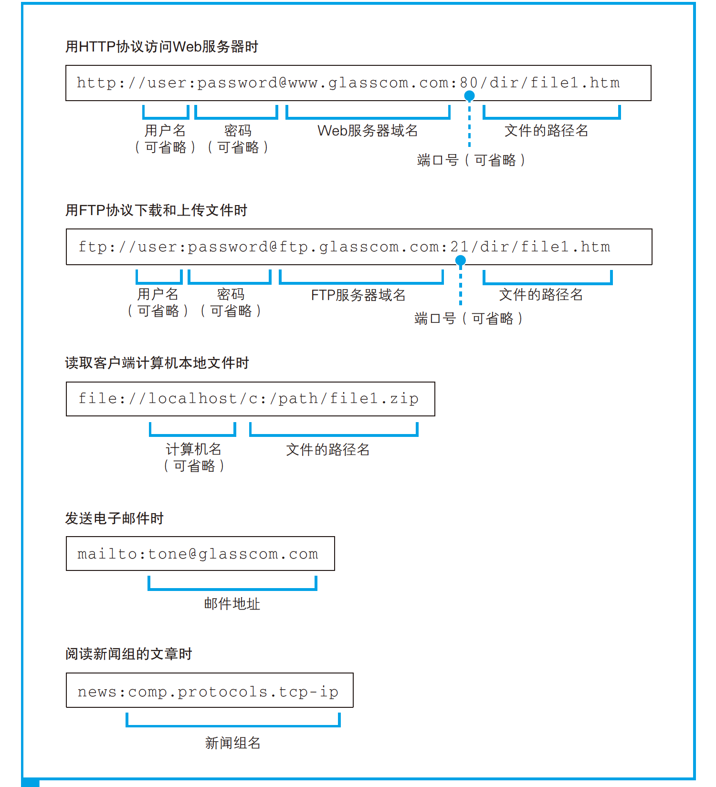
- 不同的服务器程序会使用不同的编号，例如 Web 是 80，邮件是 25 等。
- 在访问 `file:` 的 URL 时不使用网络。
- 以 `/` 结尾代表后面本来应该有的文件名被省略了。我们会在服务器上事先设置好文件名省略时要访问的默认文件名。这个设置根据服务器不同而不同，大多数情况下是 index.html 或者 default.htm 之类的文件名。
    - `/` 也可省略，如 `http://www.lab.glasscom.com`。
- `http://www.lab.glasscom.com/whatisthis`：如果 Web 服务器上存在名为 `whatisthis` 的文件，则将 `whatisthis` 作为文件名来处理；如果存在名为 `whatisthis` 的目录，则将 `whatisthis` 作为目录名来处理。
    - 我们无法创建两个名字相同的文件和目录，因此不可能既有一个名为 `whatisthis` 的文件，同时又有一个名为 `whatisthis` 的目录。只要查询一下磁盘中的文件和目录，就可以知道 `whatisthis` 究竟是一个文件还是一个目录了，并不会产生歧义。
- HTTP 协议定义了客户端和服务器之间交互的消息内容和步骤。首先，客户端会向服务器发送请求消息。请求消息中包含的内容是“对什么”和“进行怎样的操作”两个部分。
    - 其中相当于“对什么”的部分称为 URI。一般来说，URI 的内容是一个存放网页数据的文件名或者是一个 CGI 程序的文件名，例如 `/dir1/file1.html`，`/dir1/program1.cgi`。URI 不仅限于此，也可以直接使用 `http:` 开头的 URL 来作为 URI。换句话说就是，这里可以写各种**访问目标**，而这些访问目标统称为 URI。
        - URI：Uniform Resource Identifier，统一资源标识符。
        - CGI 程序：对 Web 服务器程序调用其他程序的规则所做的定义就是 CGI（Common Gateway Interface，通用网关接口），而按照 CGI 规范来工作的程序就称为 CGI 程序。
    - 相当于接下来“进行怎样的操作”的部分称为方法。方法表示需要让 Web 服务器完成怎样的工作。
        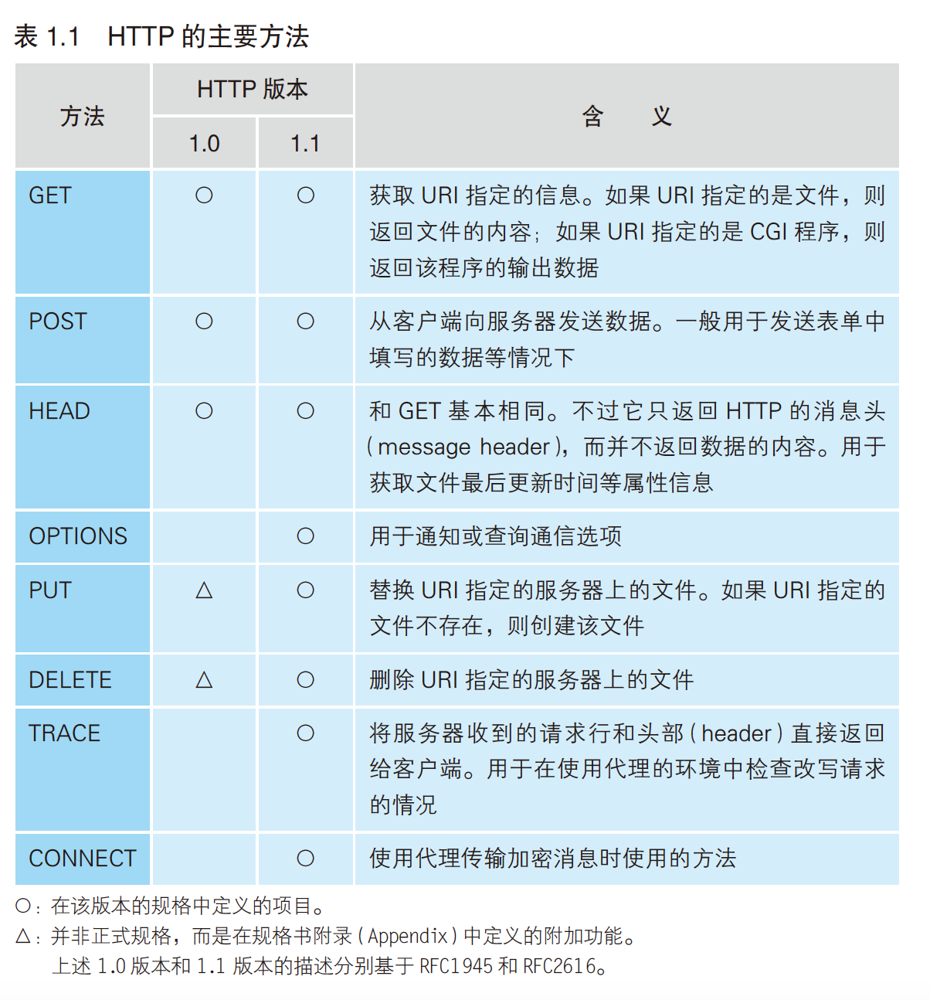
    - HTTP 消息中还有一些用来表示附加信息的头字段。客户端向 Web 服务器发送数据时，会先发送头字段，然后再发送数据。头字段属于可有可无的附加信息。
- 使用 POST 方法时，URI 会指向 Web 服务器中运行的一个应用程序的文件名，典型的例子包括 `index.cgi`，`index.php` 等。在请求消息中，除了方法和 URI 之外，还要加上传递给应用程序和脚本的数据。
- 对 URL 进行解析之后，浏览器确定了 Web 服务器和文件名，接下来就是根据这些信息来***生成 HTTP 请求消息***。
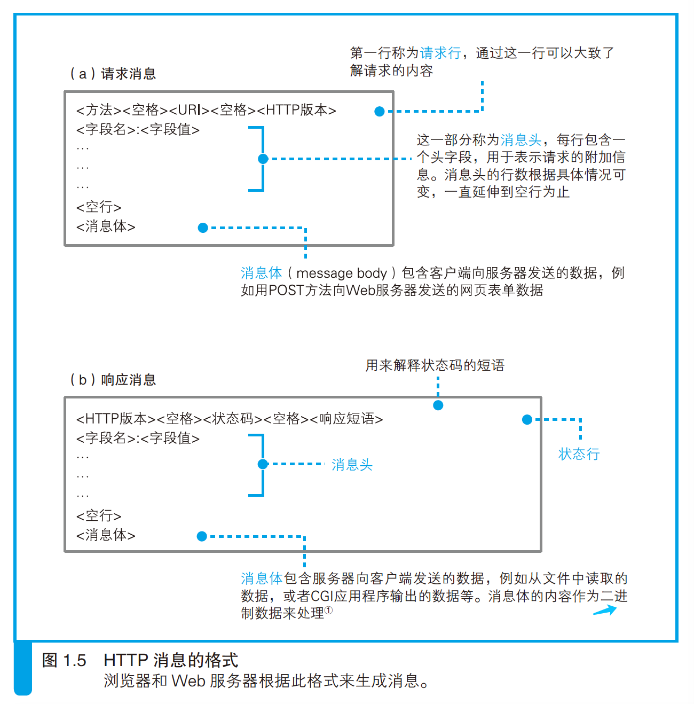
- 消息体的格式会通过消息头中的 Content-Type 字段来定义（MIME 类型）。
- 我们的场景是在地址栏中输入网址并显示网页，因此这里应该使用 GET 方法。点击超级链接的场景中也是使用 GET 方法。如果是表单，在 HTML 源代码中会在表单的属性中指定使用哪种方法来发送请求，可能是 GET 也可能是 POST。
    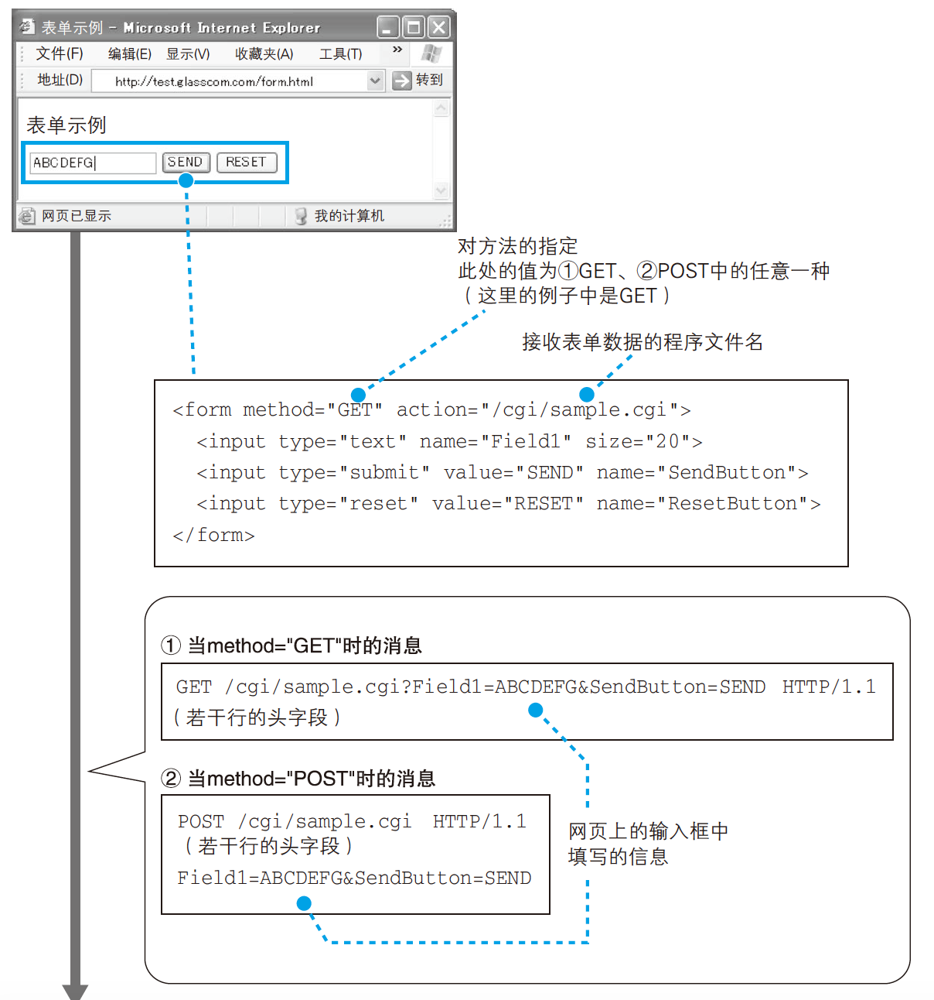
    - GET 方法能够发送的数据只有几百个字节，如果表单中的数据超过这一长度，则必须使用 POST 方法来发送。
- 尽管通过第一行我们就可以大致理解请求的内容，但有些情况下还需要一些额外的详细信息，而消息头的功能就是用来存放这些信息。
- 消息头的规格中定义了很多项目，如日期、客户端支持的数据类型、语言、压缩格式、客户端和服务器的软件名称和版本、数据有效期和最后更新时间等。
    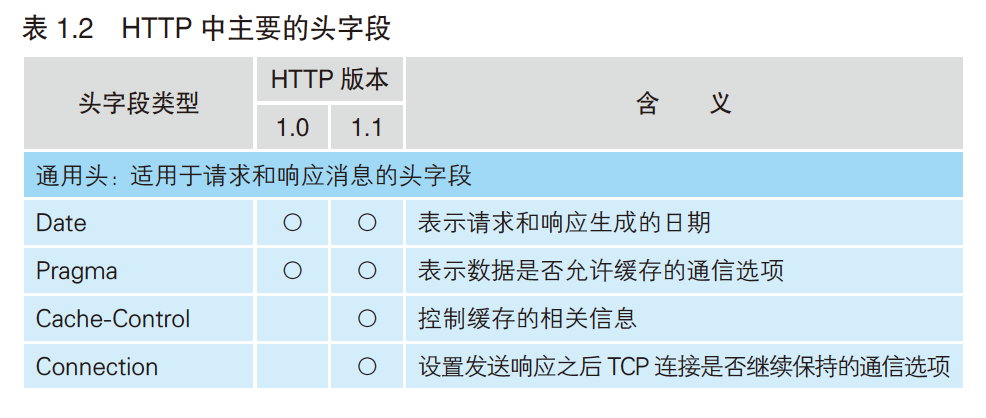
    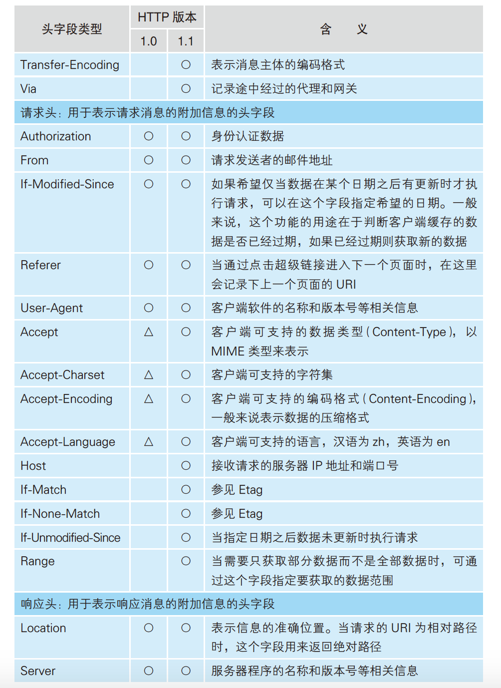
    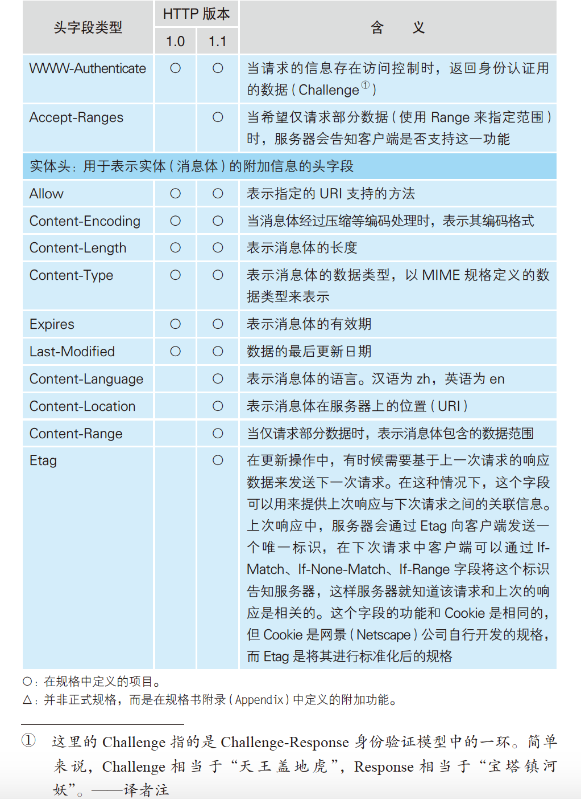
- 在使用 `GET` 方法的情况下，仅凭方法和 URI，Web 服务器就能够判断需要进行怎样的操作，因此消息体中不需要填写任何数据。当使用 POST 方法时，需要将表单中填写的信息写在消息体中。
- 在响应消息中，第一行的内容为状态码和响应短语，用来表示请求的执行结果是成功还是出错。
    - 状态码和响应短语表示的内容一致，状态码是一个数字，它主要用来向程序告知执行的结果；响应短语则是一段文字，用来向人们告知执行的结果。
    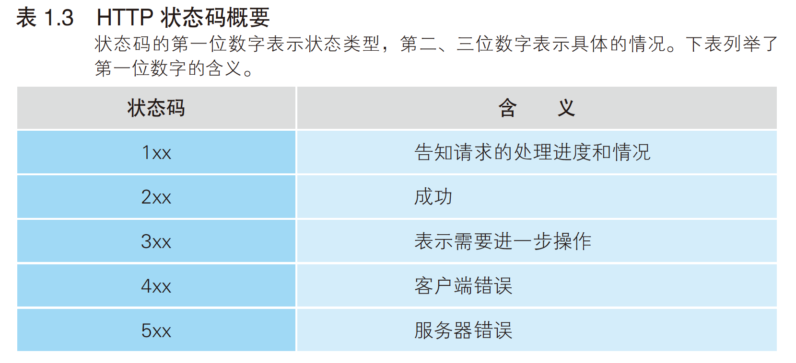
- 如果网页的内容只有文字，到这里就全部处理完毕了。
- 如果网页中还包括图片等资源，会在网页中的相应位置嵌入表示图片文件的标签的控制信息。浏览器会在显示文字时搜索相应的标签，当遇到图片相关的标签时，会在屏幕上留出用来显示图片的空间，然后再次访问 Web 服务器，按照标签中指定的文件名向 Web 服务器请求获取相应的图片并显示在预留的空间中。这个步骤和获取网页文件时一样，只要在 URI 部分写上图片的文件名并生成和发送请求消息。
    - 由于每条请求消息中只能写 1 个 URI，所以每次只能获取 1 个文件，如果需要获取多个文件，必须对每个文件单独发送 1 条请求。
    - 判断所需的文件，然后获取这些文件并显示在屏幕上，这一系列工作的整体指挥也是浏览器的任务之一。
- The `Content-Length` entity header indicates the size of the entity-body, in bytes, sent to the recipient.
# 2 向 DNS 服务器查询 Web 服务器的 IP 地址
- 尽管浏览器能够解析网址并生成 HTTP 消息，但它本身并不具备将消息发送到网络中的功能，这一功能需要委托操作系统来实现。
    - 发送消息的功能对于所有的应用程序来说都是通用的，因此让操作系统来实现这一功能，其他应用程序委托操作系统来进行操作，是一个比较合理的做法。
- 在***委托操作系统发送消息***时，必须要提供的是**通信对象的 IP 地址**，而不是它的域名，而。因此在生成 HTTP 消息之后，下一个步骤就是**根据域名查询 IP 地址**。
- TCP/IP 的结构是由一些小的子网，通过*路由器*连接起来组成一个大的网络。这里的*子网*可以理解为用*集线器*连接起来的几台计算机，我们将它看作一个单位，称为子网。将子网通过路由器连接起来，就形成了一个网络。
    - 集线器：一种对包进行转发的设备，分为中继式集线器和交换式集线器 2 种。
        - 当计算机数量较少时，可以用一台集线器连接起来；当计算机数量较多时，一台集线器可能无法连接这么多计算机，可以增加集线器数量并将集线器相互连接起来，这时，凡是通过集线器连接起来的所有设备都属于同一个子网。
    - 路由器：一种对包进行转发的设备。
        - 一些家用路由器中已经内置了集线器功能，因此可以理解为这种路由器内部同时包含路由器和集线器两种设备，它们在里面已经连接起来了。
- **在网络中，所有的设备都会被分配一个地址**。这个地址就相当于现实中某条路上的“×× 号×× 室”。“号”对应的号码是分配给整个子网，“室”对应的号码是分配给子网中的计算机。“号”对应的号码称为*网络号*，“室”对应的号码称为*主机号*。这个地址的整体称为 IP 地址。
    - IP 地址和现实中的地址含义相同，就像“×× 号×× 室”不能有两户人家的号码相同一样，也不能有两台设备使用相同的 IP 地址。现实中存在因为疏漏两台设备被分配了相同的 IP 地址的情况，这种情况下网络会发生故障，无法正常工作。
- 通过 IP 地址可以判断出访问对象服务器的位置，从而将消息发送到服务器。
    - 发送者发出的消息首先经过子网中的集线器，转发到距离发送者最近的路由器上。
        - 数据是以*包*的形式进行传送。
    - 接下来，路由器会根据消息的目的地判断下一个路由器的位置，然后将消息发送到下一个路由器，即消息再次经过子网内的集线器被转发到下一个路由器。
    - 前面的过程不断重复，最终消息就被传送到了目的地。
- 实际的 IP（*Internet Protocol*）地址是一串 32 比特的数字，按照 8 比特（1 字节）为一组分成 4 组，分别用十进制表示然后再用圆点隔开。但仅凭这一串数字无法区分网络号和主机号。
- 在 IP 地址的规则中，网络号和主机号连起来总共是 32 比特，但这两部分的具体结构不固定，在组建网络时，用户可以自行决定它们之间的分配关系，因此，我们还需要另外的附加信息来表示 IP 地址的内部结构。这一附加信息称为*子网掩码*。
    - 子网掩码是一串与 IP 地址长度相同的 32 比特数字，其左边一半都是 1，右边一半都是 0。
    - 子网掩码为 1 的部分表示网络号，子网掩码为 0 的部分表示主机号。
        - 也可以把 1 的部分的比特数目用十进制表示并写在 IP 地址的右侧。
    - 子网掩码表示**网络号与主机号之间的边界**。这个边界可以与字节的边界吻合，也可以划分在字节的中间位置。
    - 主机号部分全部为 0 代表**整个子网**而不是子网中的某台设备；主机号部分全部为 1 代表向子网上所有设备发送包，即**广播**。
    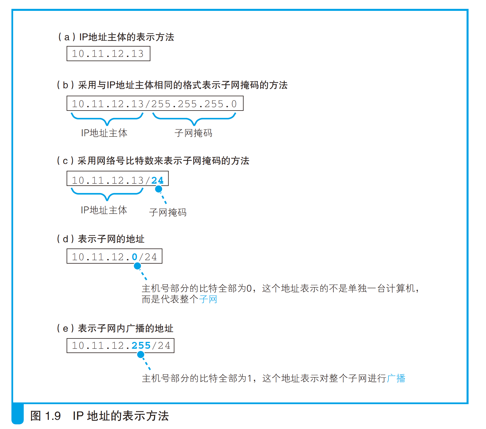
- 网址中不写服务器的名字，直接写 IP 地址也能够正常工作，但网址易记。
    - 设计 TCP/IP 架构时，技术上还无法实现我们今天的搜索引擎，因此用名称来代替地址本身是有价值的。
    - > 如果 Web 服务器使用了虚拟主机功能，有可能无法通过 IP 地址来访问。
- 若干脆不用 IP 直接用域名，IP 地址的长度为 32 比特，即 4 字节；域名最短也要几十个字节，最长甚至可以达到 255 字节，会增加路由器负担，传送数据也会花费更长的时间。
    - 域名不仅长，而且其长度不固定。处理长度不固定的数据比处理长度固定的数据要复杂，这也是造成效率低下的重要原因之一。
- 现在我们使用的方案是**让人来使用名称，让路由器来使用 IP 地址**。为了填补两者之间的障碍，需要有一个机制能够通过名称来查询 IP 地址，或者通过 IP 地址来查询名称，这样就能够在人和机器双方都不做出牺牲的前提下完美地解决问题。这个机制就是 DNS（*Domain Name System*，域名服务系统）
    - 将服务器名称和 IP 地址进行关联是 DNS 最常见的用法，DNS 还可以将邮件地址和邮件服务器进行关联，以及为**各种信息关联相应的名称**。
- 查询 IP 地址只需要要询问最近的 DNS 服务器“www.lab.glasscom.com 的 IP 地址是什么”，DNS 服务器回答“该服务器的 IP 地址为 xxx.xxx.xxx.xxx”。
- 向 DNS 服务器发出查询，也就是向 DNS 服务器发送查询消息，并接收服务器返回的响应消息。对于 DNS 服务器，我们的计算机上一定有相应的 DNS 客户端，称之为 *DNS 解析器*，简称解析器。
    - 通过 DNS 查询 IP 地址的操作称为*域名解析*，因此负责执行解析（resolution）这一操作的就叫解析器（resolver）。
- 解析器实际上是一段程序，它包含在操作系统的 *Socket 库*中。
- Socket 库是让其他应用程序来调用的操作系统网络功能的程序组件集合。
    - Socket 库是在加州大学伯克利分校开发的 UNIX 系操作系统 BSD 中开发的 C 语言库，互联网中所使用的大多数功能都基于 Socket 库来开发。因此，BSD 之外的其他操作系统以及 C 语言之外的其他编程语言也参照 Socket 库开发了相应的网络库。可以说，Socket 库是网络开发中的一种标准库。
    - Socket 库也包含很多用于发送和接收数据的程序组件。
- Socket 库中的程序都是标准组件，只要从应用程序中进行调用即可。具体来说，在编写浏览器等应用程序的时候，只要写上解析器的程序名称 `gethostbyname` 以及 Web 服务器的域名 `www.lab.glasscom.com` ，就完成了对解析器的调用。
    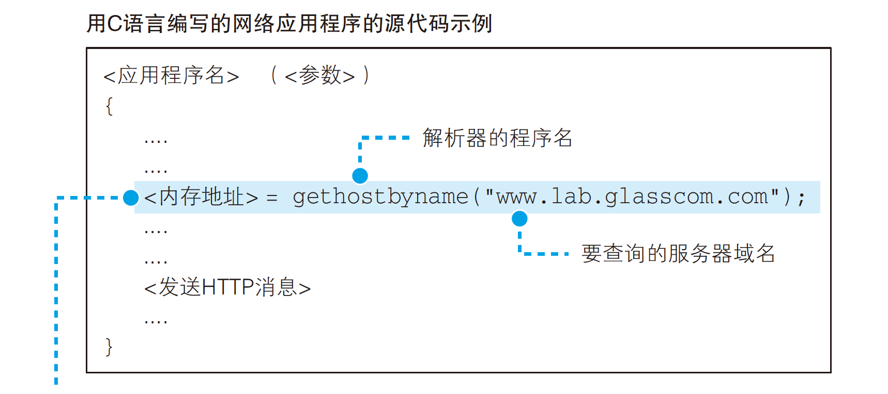
    - 运行这一行程序后，服务器的 IP 地址就会被写入指定的内存地址中。接下来，浏览器在向 Web 服务器发送消息时，只要从该内存地址取出 IP 地址，并将它与 HTTP 请求消息一起交给操作系统即可。
- 网络应用程序（在我们的场景中就是指浏览器）调用解析器时，程序的控制流程就会转移到解析器的内部。解析器会生成要发送给 DNS 服务器的查询消息。
    - 这个过程与浏览器生成要发送给 Web 服务器的 HTTP 请求消息的过程类似，解析器会根据 DNS 的规格，生成一条表示“请告诉我 www.lab.glasscom.com 的 IP 地址”的数据，并将它发送给 DNS 服务器。
        - HTTP 消息是用文本编写的，但 DNS 消息是使用二进制数据编写的。
- 发送消息这个操作并不是由解析器自身来执行，而是委托给操作系统内部的*协议栈*来执行。解析器调用协议栈后，控制流程会再次转移，协议栈会执行发送消息的操作，然后通过**网卡**将消息发送给 DNS 服务器。
    - 和浏览器一样，解析器本身也不具备使用网络收发数据的功能。
    - 协议栈：操作系统内部的网络控制软件，也叫“协议驱动”，“TCP/IP 驱动”等。
- 当 DNS 服务器收到查询消息后，它会根据消息中的查询内容进行查询。如果要访问的 Web 服务器已经在 DNS 服务器上注册，那么这条记录就能够被找到，然后其 IP 地址会被写入响应消息并返回给客户端。接下来，消息经过网络到达客户端，再经过协议栈被传递给解析器，然后解析器读取出消息取出 IP 地址，并将 IP 地址传递给应用程序。到这里，解析器的工作就完成了，控制流程重新回到应用程序（浏览器），现在应用程序已经拿到 IP 地址了。
- 向 DNS 服务器发送消息时，我们当然也需要知道 DNS 服务器的 IP 地址。只不过这个 IP 地址是作为 TCP/IP 的一个设置项目事先设置好的，不需要再去查询了。
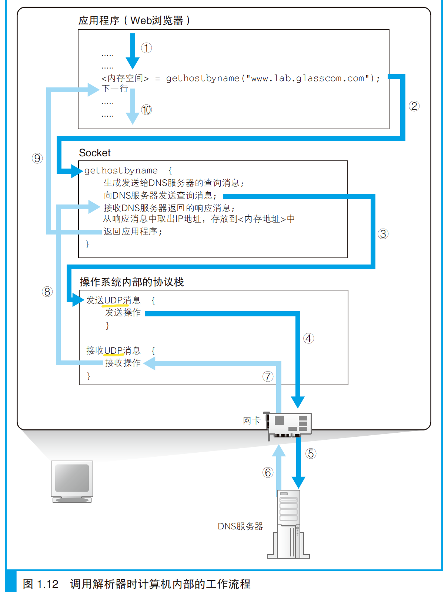
# 3 全世界 DNS 服务器接力
- DNS 服务器的基本工作就是接收来自客户端的查询消息，然后根据消息的内容返回响应。
- 来自客户端的查询消息包含以下 3 种信息：
    1. 域名
        - 服务器、邮件服务器（邮件地址中 @ 后面的部分）的名称。
    2. Class
        - 最早设计 DNS 方案时，DNS 在互联网以外的其他网络中的应用也被考虑到了，Class 就是用来识别网络的信息。如今除了互联网并没有其他的网络了，因此 Class 的值永远是代表互联网的 `IN`。
    3. *记录类型*
        - 表示**域名对应何种类型的记录**。例如，当类型为 A 时，表示域名对应的是 IP 地址；当类型为 MX 时，表示域名对应的是邮件服务器。对于不同的记录类型，服务器向客户端返回的信息也会不同。
            - A: Address
            - MX: Mail eXchange
            - 其他类型：根据 IP 地址反查域名的 PTR 类型，查询域名相关别名的 CNAME 类型，查询 DNS 服务器 IP 地址的 NS 类型，以及查询域名属性信息的 SOA 类型等。
- DNS 服务器上事先保存有前面这 3 种信息对应的记录数据，DNS 服务器就是根据这些记录查找符合查询请求的内容并对客户端作出响应。
    - 这些信息保存在**配置文件**中，下表中的一行信息被为一条*资源记录*。
- 查询 `www.lab.glasscom.com` 这个域名对应的 IP 地址，客户端会向 DNS 服务器发送包含以下信息的查询消息：
    1. 域名 = www.lab.glasscom.com
    2. Class = IN
    3. 记录类型 = A
    - DNS 服务器会从已有的记录中查找域名、Class 和记录类型**全部匹配**的记录。
    - Web 服务器的域名很多以 www 开头的，但这不是一定之规，只是因为最早设计 Web 的时候，很多 Web 服务器都采用了 www 这样的命名（www 是服务器的名称），后来就形成了一个惯例。
    - 只要是作为 A 记录在 DNS 服务器上注册的，都可以作为 Web 服务器的域名。
    - 不仅是 Web 服务器，像邮件服务器、数据库服务器等，无论任何服务器，只要注册了 A 类型的记录，都可以作为服务器的域名来使用。准确来说，**A 类型的记录表示与 IP 地址所对应的域名**，因此与其说是某个服务器的域名，不如说是被分配了某个 IP 地址的某台具体设备的域名。
- 查询邮件地址 `tone@glasscom.com` 对应的邮件服务器时，需要提供 @ 后面的那一串名称。查询消息的内容如下：
    1. 域名 = glasscom.com
    2. Class = IN
    3. 记录类型 = MX
    - DNS 服务器会返回 10 和 mail.glasscom.com 这两条信息。当记录类型为 MX 时，DNS 服务器会在记录中保存两种信息，分别是邮件服务器的**域名**和*优先级*。
        - 当一个邮件地址对应多个邮件服务器时，需要根据优先级来判断哪个邮件服务器是优先的。优先级**数值较小**的邮件服务器代表更优先。
    - 此外，MX 记录的返回消息还包括邮件服务器 mail.glasscom.com 的 IP 地址。下表第三行就是 mail.glasscom.com 的 IP 地址，因此只要用 mail.glasscom.com 的域名就可以找到这条记录。在这个例子中，我们得到的 IP 地址是 192.0.2.227。
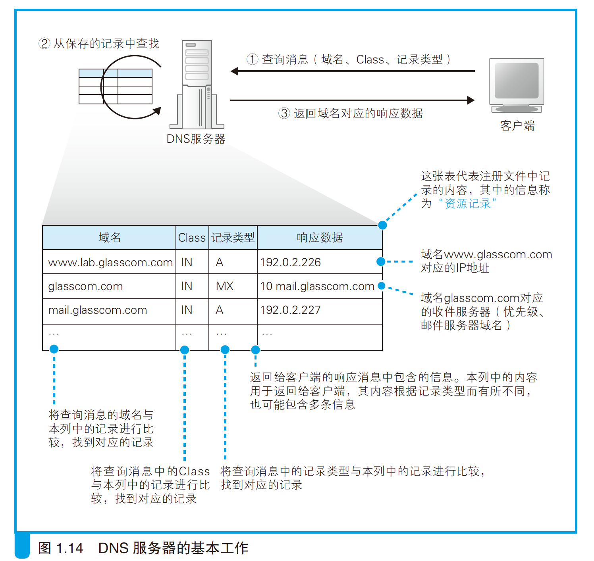
- 互联网中存在着不计其数的服务器，将这些服务器的信息全部保存在一台 DNS 服务器中是不可能的，因此一定会出现在 DNS 服务器中找不到要查询的信息的情况。
- DNS 服务器中的所有信息按照域名以分层次的结构来保存。*层次结构*能够帮助我们更好地管理大量的信息。
    - DNS 中的域用句点来分隔，如 `www.lab.glasscom.com`，越靠右的位置表示其层级越高。
    - 相当于一个层级的部分称为*域*。
    - 一台 DNS 服务器可以存放多个域的信息，因此并不是每个域名都有一台与之相对应的 DNS 服务器。比如网络运营商的 DNS 服务器中就存放了很多个域的信息。
- 这种具有层次结构的域名信息会注册到 DNS 服务器中，每个域都是作为一个整体来处理的。
- 假设一台 DNS 服务器中只存放一个域的信息，于是，DNS 服务器也具有了像域名一样的层次结构，每个域的信息都存放在相应层级的 DNS 服务器中。
- 例如，有一个公司的域，那么就相应地有一台 DNS 服务器，其中存放了公司中所有 Web 服务器和邮件服务器的信息。如果需要为每一个事业集团配备一台 DNS 服务器，分别管理各事业集团自己的信息，由于一个域是不可分割的，但是我们可以在域的下面创建*下级域*，然后再将它们分别分配给各个事业集团。
    - 下级的域称为*子域*。
    - 比如 www.nikkeibp.co.jp，最上层的 jp 代表分配给日本这个国家的域；下一层的 co 是日本国内进行分类的域，代表公司；再下层的 nikkeibp 就是分配给某个公司的域；最下层的 www 就是服务器的名称。
- 关键在于找到我们要访问的 Web 服务器的信息归哪一台 DNS 服务器管。
- 将负责管理下级域的 DNS 服务器的 IP 地址注册到它们的上级 DNS 服务器中，然后上级 DNS 服务器的 IP 地址再注册到更上一级的 DNS 服务器中，以此类推。这样，我们就可以通过上级 DNS 服务器查询出下级 DNS 服务器的 IP 地址，也就可以向下级 DNS 服务器发送查询请求了。
- com、jp 这些域（称为*顶级域*）上面还有一级域，称为*根域*。根域不像 com、jp 那样有自己的名字，因此在一般书写域名时经常被省略，如果要明确表示根域，应该像 `www.lab.glasscom.com.` 这样在域名的最后再加上一个**句点**，而这个最后的句点就代表根域。根域的 DNS 服务器中保管着 com、jp 等的 DNS 服务器的信息。
- 由于上级 DNS 服务器保管着所有下级 DNS 服务器的信息，所以我们可以从根域开始一路往下顺藤摸瓜找到任意一个域的 DNS 服务器。
- 除此之外还需要完成另一项工作，那就是**将根域的 DNS 服务器信息保存在互联网中所有的 DNS 服务器中**。这样一来，任何 DNS 服务器就都可以找到并访问根域 DNS 服务器了。因此，客户端只要能够找到任意一台 DNS 服务器，就可以通过它找到根域 DNS 服务器，然后再一路顺藤摸瓜找到位于下层的某台目标 DNS 服务器。
    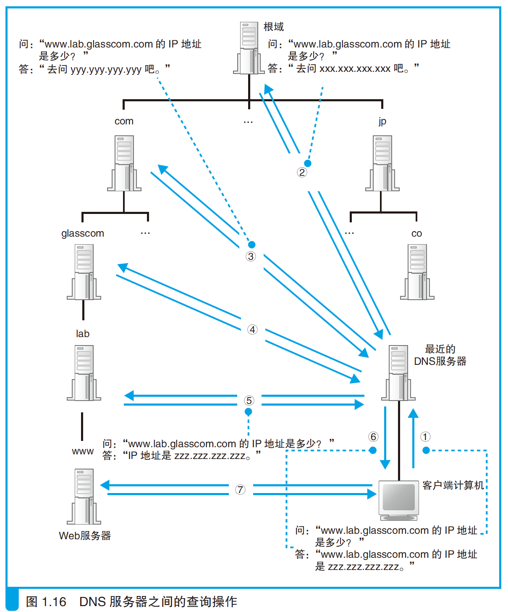
- 分配给根域 DNS 服务器的 IP 地址在全世界仅有 **13** 个，而且这些地址几乎不发生变化，因此将这些地址保存在所有的 DNS 服务器中也并不是一件难事。
    - 实际上，根域 DNS 服务器的相关信息已经包含在 DNS 服务器程序的配置文件中了，因此只要安装了 DNS 服务器程序，这些信息也就被自动配置好了。
    - **根域 DNS 服务器在运营上使用多台服务器来对应一个 IP 地址**，因此尽管 IP 地址只有 13 个，但其实服务器的数量是很多的。
# 4 委托协议栈发送消息
continue at p43