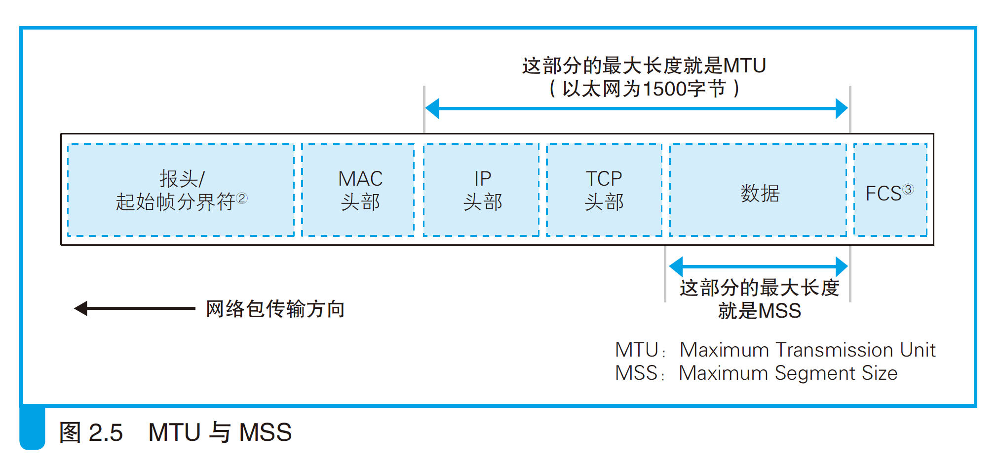
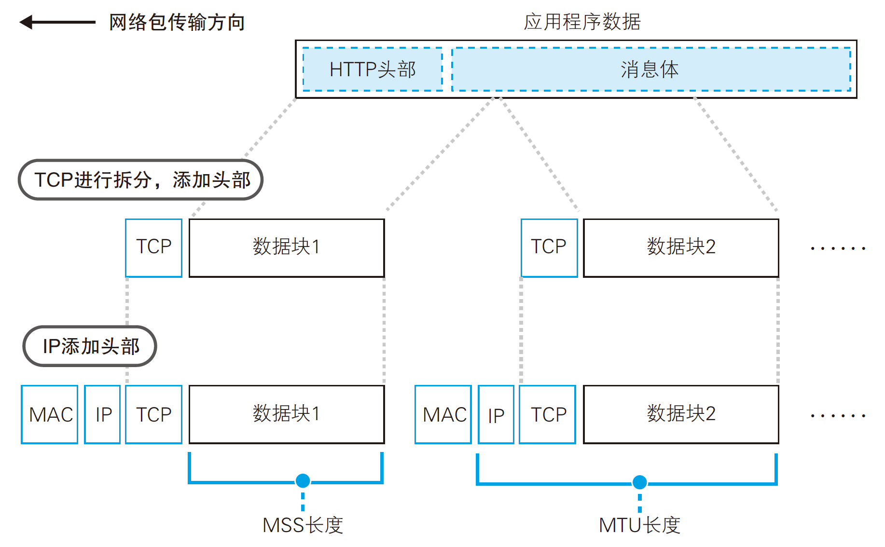
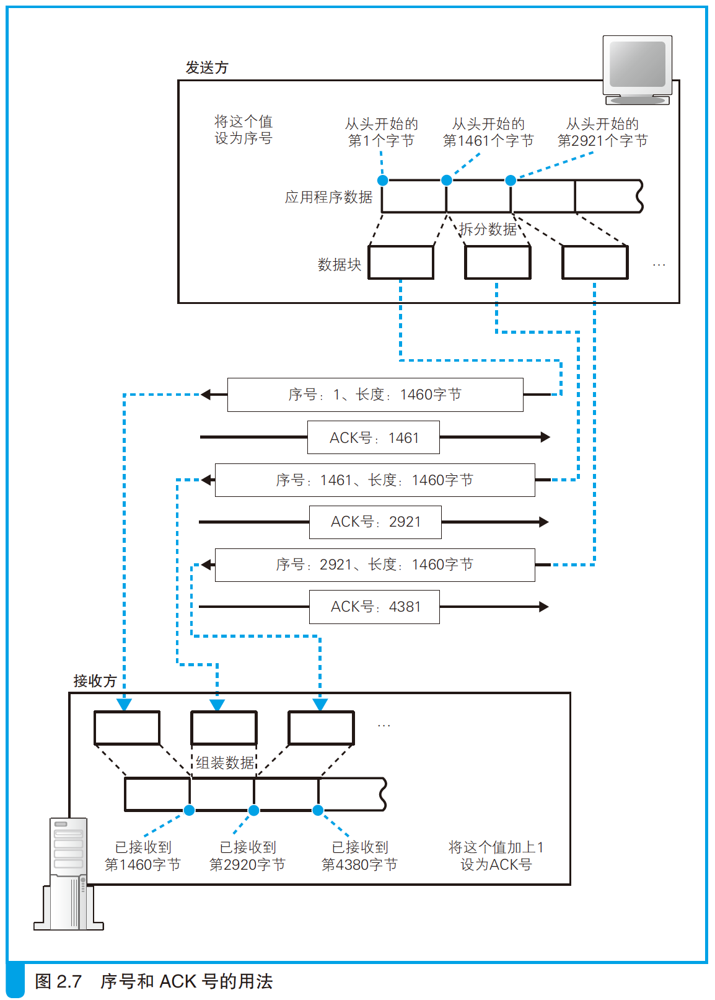

- 一般情况下，以太网的头部（网络包开头的控制信息）格式并非遵循国际标准（IEEE802.3/802.2），而是遵循一个更古老的规格（以太网第 2 版，又称 DIX 规格），相对地，国际标准（IEEE802.3/802.2）的头部格式由于长度太长、效率降低而没有普及。
# 1. 创建 socket
- TCP/IP 软件采用分层结构，上层会向下层逐层委派工作。
    
    - 这一上下关系只是一个总体的规则，其中也有一部分上下关系不明确，或者上下关系相反的情况。
- 协议栈的上半部分有两块，分别是负责用 TCP 协议收发数据的部分和负责用 UDP 协议收发数据的部分，它们会接受应用程序的委托执行收发数据的操作。下面一半是用 IP 协议控制网络包收发操作的部分。在互联网上传送数据时，数据会被切分成一个一个的网络包，而将网络包发送给通信对象的操作就是由 IP 来负责的。
    - 浏览器、邮件等一般应用程序收发数据时用 TCP；DNS 查询等收发较短的控制数据时用 UDP。
    - 网络中的数据会被切分成几十字节到几千字节的小块，每一个小数据块被称为一个包。
    - IP 中还包括 *ICMP 协议*和 *ARP 协议*。ICMP 用于告知网络包传送过程中产生的错误以及各种控制消息，ARP 用于根据 IP 地址查询相应的以太网 MAC 地址。
        - 符合 IEEE 规格的局域网设备都使用同一格式的地址，这种地址被称为 *MAC 地址*。
- IP 下面的网卡驱动程序负责控制网卡硬件，而最下面的网卡则负责完成实际的收发操作，也就是对网线中的信号执行发送和接收的操作。
- 协议栈内部有一块用于存放**控制信息**的内存空间，这里记录了用于控制通信操作的控制信息，例如通信对象的 IP 地址、端口号、通信操作的进行状态等。
    - 在发送数据时，需要看一看 socket 中的通信对象 IP 地址和端口号，以便向指定的 IP 地址和端口发送数据。
    - 在发送数据之后，协议栈需要等待对方返回收到数据的响应信息，但数据也可能在中途丢失，永远也等不到对方的响应。在这样的情况下，我们不能一直等下去，需要在等待一定时间之后重新发送丢失的数据，这就需要协议栈能够知道执行发送数据操作后过了多长时间。为此，socket 中必须要记录是否已经收到响应，以及发送数据后经过了多长时间，才能根据这些信息按照需要执行重发操作。
- 本来 socket 只是一个概念，并不存在实体，如果一定要赋予它一个实体，我们可以说这些控制信息就是 socket 的实体，或者说存放控制信息的内存空间就是 socket 的实体。
- socket 中记录了用于控制通信操作的各种控制信息，协议栈则需要根据这些信息判断下一步的行动，这就是 **socket 的作用**。
- `netstat` 查看 socket 内容：
	
    ```bash
    # netstat -nat | grep LISTEN
    netstat
    # Proto Recv-Q Send-Q Local Address           Foreign Address         State      
    # tcp        0      0 instance-1.asia-e:56156 metadata.google.in:http TIME_WAIT  
    # tcp        0      0 instance-1.asia-e:56152 metadata.google.in:http TIME_WAIT  
    # tcp        0      0 instance-1.asia-e:56150 metadata.google.in:http TIME_WAIT  
    # tcp        0      0 instance-1.asia-e:56146 metadata.google.in:http ESTABLISHED
    # tcp        0      0 instance-1.asia-e:56162 metadata.google.in:http TIME_WAIT  
    # tcp        0    528 instance-1.asia-eas:ssh 112.10.27.63:4270       ESTABLISHED
    # tcp        0      0 instance-1.asia-e:56140 metadata.google.in:http CLOSE_WAIT 
    ```

    
    - 本地 IP 地址和远程 IP 地址都是 0.0.0.0，这表示通信还没开始，IP 地址不确定。
    - 对于处于等待连接状态的 socket，也可以绑定 IP 地址，如果绑定了 IP 地址，那么除绑定的 IP 地址之外，对其他地址进行连接操作都会出错。当服务器上安装有多块网卡时，可以用这种方式来限制只能连接到特定的网卡。
# 2. 连接服务器
- 连接实际上是通信双方**交换控制信息**，在 socket 中记录这些必要信息并准备数据收发的一连串操作。
- 控制信息大体上分为 2 类：
    1. 头部中记录的信息。
        - 客户端和服务器相互联络时交换的控制信息。
        - 这些信息不仅连接时需要，包括数据收发和断开连接操作在内，整个通信过程中都需要。这些字段是固定的，在 TCP 协议的规格中进行了定义。
        - 在连接阶段，由于数据收发还没有开始，网络包中没有实际的数据，只有控制信息。这些控制信息位于网络包的开头，因此被称为*头部*（TCP）。
            - 以太网和 IP 协议也有自己的控制信息，这些信息也叫头部，为了避免各种不同的头部发生混淆，一般会记作 TCP 头部、以太网头部、IP 头部。以太网头部又称“MAC 头部”。
        
        - 客户端和服务器在通信中会将必要的信息记录在头部并相互确认，例如：

            ```
            发送方：“开始数据发送。”
            接收方：“请继续。”
            发送方：“现在发送的是 ×× 号数据。”
            接收方：“×× 号数据已收到。”
            ……（以下省略）
            ```

            
    2. socket（位于协议栈中的内存空间）中记录的信息。
        - 保存在 socket 中，用来控制协议栈操作的信息。
        - 应用程序传递来的信息以及从通信对象接收到的信息都会保存在这里，还有收发数据操作的执行状态等信息也会保存在这里，协议栈会根据这些信息来执行每一步的操作。
        - 协议栈具体需要哪些信息会根据协议栈本身的实现方式不同而不同。可以用 `netstat` 命令显示一些重要的 socket 控制信息，这些信息无论何种操作系统的协议栈都是共通的。
- 从应用程序调用 Socket 库的 `connect` 开始：`connect(<描述符>, <服务器 IP 地址和端口号>, …)`。调用提供了服务器的 IP 地址和端口号，这些信息会传递给协议栈中的 TCP 模块。TCP 模块会与该 IP 地址对应的对象，也就是与服务器的 TCP 模块交换控制信息。
- 连接操作的第一步是在 TCP 模块处创建表示连接控制信息的头部。通过 TCP 头部中的发送方和接收方端口号可以找到要连接的 socket。然后，将头部中的控制位的 `SYN` 比特设置为 1，此外还需要设置适当的序号和窗口大小。
- TCP 头部创建好之后，TCP 模块会将信息传递给 IP 模块并委托它进行发送。
- IP 模块执行网络包发送操作后，网络包就会通过网络到达服务器，然后服务器上的 IP 模块会将接收到的数据传递给 TCP 模块，服务器的 TCP 模块根据 TCP 头部中的信息找到端口号对应的 socket，即从处于等待连接状态的 socket 中找到与 TCP 头部中记录的端口号相同的 socket。当找到对应的 socket 后，socket 中会写入相应的信息，并将状态改为**正在连接**。
- 上述操作完成后，服务器的 TCP 模块会返回响应，这个过程和客户端一样，需要在 TCP 头部中设置发送方和接收方端口号以及 `SYN` 比特。此外，在返回响应时还需要将 `ACK` 控制位设为 1，这表示已经接收到相应的网络包。
    - 如果由于某些原因不接受连接，那么将不设置 `SYN`，而是将 `RST` 比特设置为 1。
    - 客户端向服务器发送第一个网络包时，由于服务器还没有接收过网络包，所以需要将 `ACK` 比特设为 0。
    - 网络中经常会发生错误，网络包也会发生丢失，因此双方在通信时必须相互确认网络包是否已经送达，设置 `ACK` 比特的目的就是为了进行这一确认。
- 接下来，服务器 TCP 模块会将 TCP 头部传递给 IP 模块，并委托 IP 模块向客户端返回响应。网络包就会返回到客户端，通过 IP 模块到达 TCP 模块，并通过 TCP 头部的信息确认连接服务器的操作是否成功。
    - 如果 `SYN` 为1 则表示连接成功，这时会向 socket 中写入服务器的 IP 地址、端口号等信息，同时还会将状态改为**连接完毕**。
- 相应地，客户端也需要将 `ACK` 比特设置为 1 并发回服务器，告诉服务器刚才的响应包已经收到。当这个服务器收到这个返回包之后，连接操作才算全部完成。
- 现在，socket 就已经进入随时可以收发数据的状态了。只要数据传输过程在持续，在调用 `close` 断开之前，连接是一直存在的。
- 建立连接之后，协议栈的连接操作结束，即 `connect` 执行完毕，控制流程被交回到应用程序。
# 3. 收发数据
- 数据收发操作是从应用程序调用 `write` 将要发送的数据交给协议栈开始，协议栈收到数据后执行发送操作。
- 首先，协议栈并不关心应用程序传来的数据是什么内容，应用程序在调用 `write` 时会指定发送数据的长度，在协议栈看来，要发送的数据只是一定长度的二进制字节序列。
- 其次，协议栈并不是一收到数据就马上发送出去，而是会将数据存放在内部的*发送缓冲区*中，并等待应用程序的下一段数据。
    - 一次将多少数据交给协议栈由应用程序自行决定，协议栈不能控制这一行为，因此如果一收到数据就马上发送出去，就可能会发送大量的小包，导致网络效率下降，因此需要在数据积累到一定量时再发送出去。
    - 累计的数据大小不同种类和版本的操作系统会有所不同，根据下面几个要素来判断：
        1. 是每个网络包能容纳的数据长度
            - 协议栈会根据一个叫作 MTU 的参数来进行判断。MTU 表示一个网络包的最大长度，在以太网中一般是 1500 字节。MTU 是包含头部的总长度，因此需要从 MTU 减去头部的长度，然后得到的长度就是一个网络包中所能容纳的最大数据长度，这一长度叫作 MSS。当从应用程序收到的数据长度超过或者接近 MSS 时再发送出去，就可以避免发送大量小包的问题。
            - MTU：*Maximum Transmission Unit*，最大传输单元。在使用 PPPoE 的 ADSL 等网络中，需要额外增加一些头部数据，MTU 会小于 1500 字节。
            - MSS：*Maximum Segment Size*，最大分段大小。TCP 和 IP 的头部加起来一般是 40 字节，因此 MTU 减去这个长度就是 MSS。例如，以太网中 MTU 为 1500，因此 MSS 就是1460。TCP/IP 可以使用一些可选参数（protocol option），如加密等，这时头部的长度会增加，那么 MSS 就会随着头部长度增加而相应缩短。
            - 起始帧分界符：Start Frame Delimiter，SFD。
            - FCS：Frame Check Sequence，帧校验序列。
            
        2. 时间
            - 当应用程序发送数据的频率不高的时候，如果每次都等到长度接近 MSS 时再发送，可能会因为等待时间太长而造成发送延迟，这种情况下，即便缓冲区中的数据长度没有达到 MSS，也应该果断发送出去。
            - 协议栈的内部有一个计时器（毫秒为单位），当经过一定时间之后，就会把网络包发送出去。
    - 在进行发送操作时需要综合考虑这 2 个要素以达到平衡，TCP 协议中并未规定，实际如何判断由协议栈的开发者决定，因此不同种类和版本的操作系统在相关操作上也就存在差异。
- 协议栈也给应用程序保留了控制发送时机的余地。应用程序在发送数据时可以指定一些选项，比如如果指定“不等待填满缓冲区直接发送”，则协议栈就会按照要求直接发送数据。
    - 像浏览器这种会话型的应用程序在向服务器发送数据时，等待填满缓冲区导致延迟会产生很大影响，因此一般会使用直接发送的选项。
- HTTP 请求消息一般不会很长，一个网络包就能装得下，但如果其中要提交表单数据，长度就可能超过一个网络包所能容纳的数据量。
    - 如在博客或者论坛上发表一篇长文就属于这种情况。
- 发送缓冲区中的数据会被以 MSS 长度为单位进行拆分，拆分出来的每块数据会被放进单独的网络包中。
- 根据发送缓冲区中的数据拆分的情况，当判断需要发送这些数据时，就在每一块数据前面加上 TCP 头部，并根据 socket 中记录的控制信息标记发送方和接收方的端口号，然后交给 IP 模块来执行发送数据的操作。IP 模块会在网络包前面添加 IP 头部和以太网的 MAC 头部后发送网络包。
    
- TCP 具备确认对方是否成功收到网络包，以及当对方没收到时进行重发的功能，因此在发送网络包之后还需要进行确认操作。
- 首先，TCP 模块在拆分数据时，会先算好每一块数据相当于从头开始的第几个字节，接下来在发送这一块数据时，将算好的字节序号写在 TCP 头部中的*序号*字段。然后，发送数据的长度也需要告知接收方，不过这个并不是放在 TCP 头部里面的，因为用整个网络包的长度减去头部的长度就可以得到数据的长度，所以接收方可以用这种方法来进行**计算**。这样就可以知道发送的数据是从第几个字节开始，长度是多少。
    - 通过这些信息，接收方还能够检查收到的网络包有没有遗漏。例如上次接收到第 1460 字节，接下来如果收到序号为 1461 的包，说明中间没有遗漏；但如果收到的包序号为 2921，那就说明中间有包遗漏了。
- 如果确认没有遗漏，接收方会将到目前为止接收到的数据长度加起来，计算出**一共已经收到了多少个字节**，然后将这个数值写入 TCP 头部的 *`ACK` 号*中发送给发送方。这个返回 `ACK` 号的操作被称为*确认响应*。
    - 返回 `ACK` 号时，除了要设置 `ACK` 号的值以外，还需要将控制位中的 `ACK` 比特设为 1，这代表 `ACK` 号字段有效，接收方也就可以知道这个网络包是用来告知 `ACK` 号的。
    - 发送方：“现在发送的是从第××字节开始的部分，一共有××字节。”接收方回复：“到第××字节**之前**的数据我已经都收到了。”
- 在实际的通信中，序号不是从 1 开始，需要用随机数计算出一个初始值。
    
    - 如果序号都从 1 开始，通信过程就会非常容易预测，有人会利用这一点来发动攻击。
# 4. 从服务器断开连接并删除 socket
# 5. IP 与以太网的包收发操作
# 6. 用 UDP 协议收发数据的操作


continue at p81
