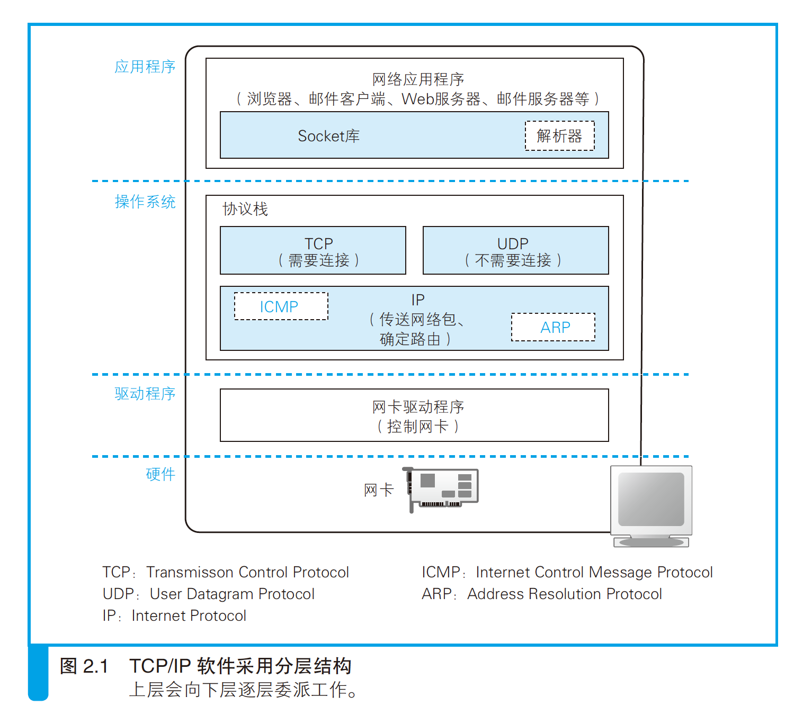
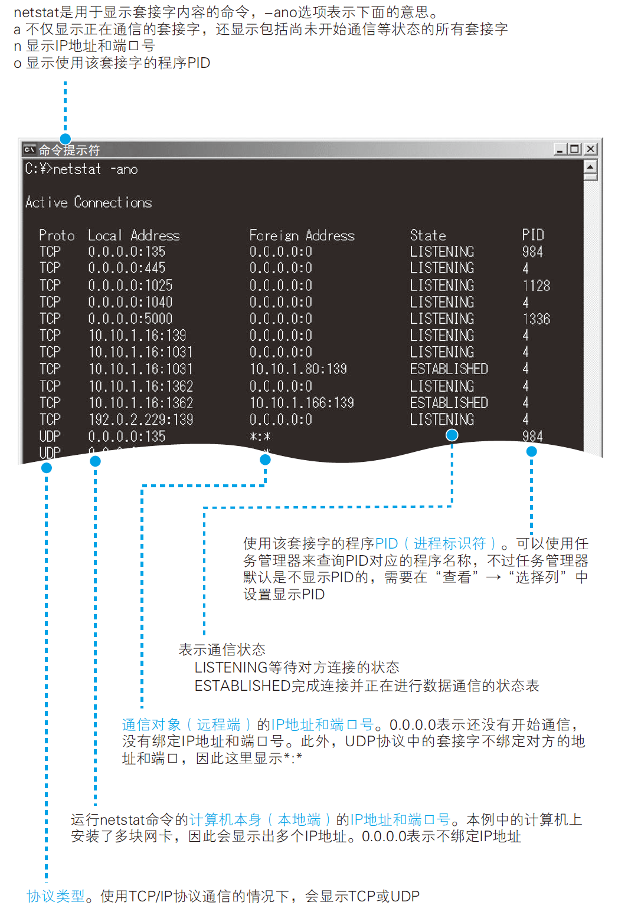
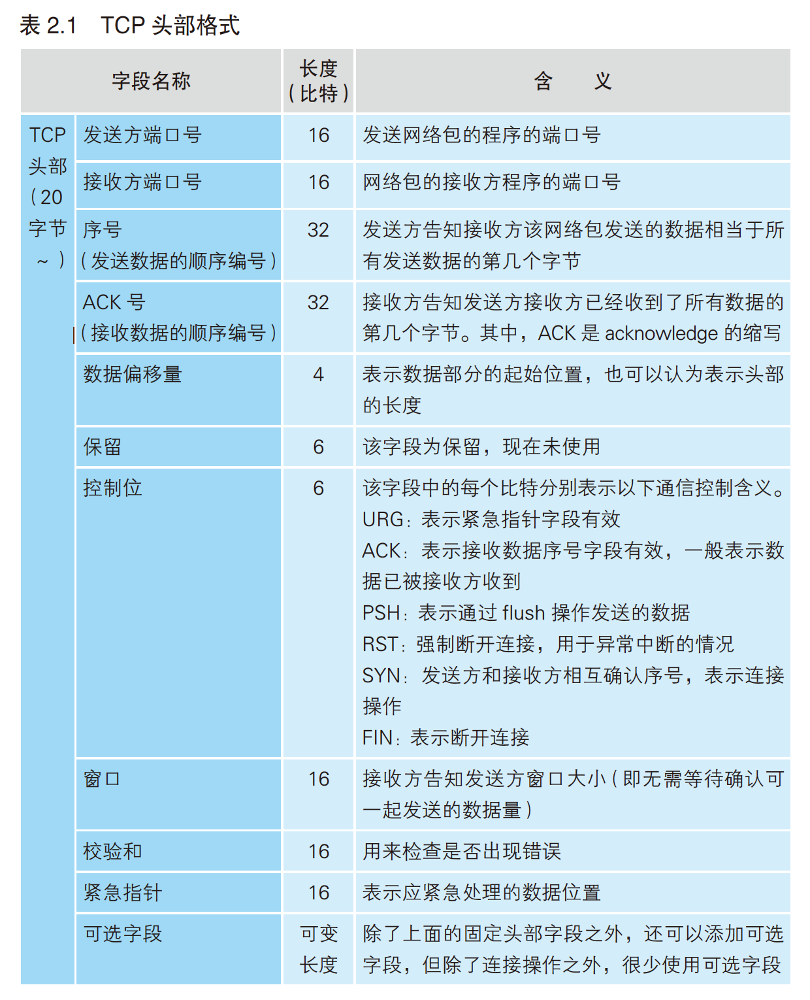
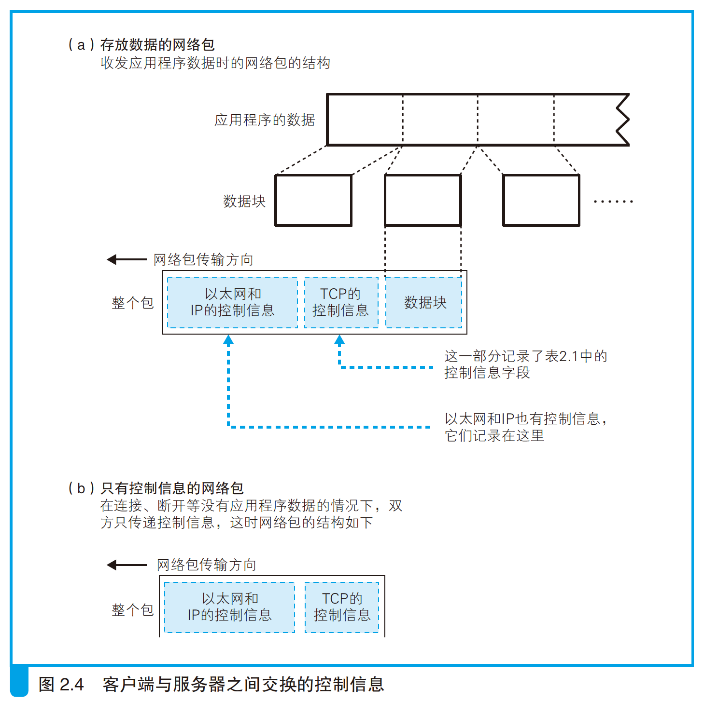

- 一般情况下，以太网的头部（网络包开头的控制信息）格式并非遵循国际标准（IEEE802.3/802.2），而是遵循一个更古老的规格（以太网第 2 版，又称 DIX 规格），相对地，国际标准（IEEE802.3/802.2）的头部格式由于长度太长、效率降低而没有普及。
# 1. 创建 socket
- TCP/IP 软件采用分层结构，上层会向下层逐层委派工作。
    
    - 这一上下关系只是一个总体的规则，其中也有一部分上下关系不明确，或者上下关系相反的情况。
- 协议栈的上半部分有两块，分别是负责用 TCP 协议收发数据的部分和负责用 UDP 协议收发数据的部分，它们会接受应用程序的委托执行收发数据的操作。下面一半是用 IP 协议控制网络包收发操作的部分。在互联网上传送数据时，数据会被切分成一个一个的网络包，而将网络包发送给通信对象的操作就是由 IP 来负责的。
    - 浏览器、邮件等一般应用程序收发数据时用 TCP；DNS 查询等收发较短的控制数据时用 UDP。
    - 网络中的数据会被切分成几十字节到几千字节的小块，每一个小数据块被称为一个包。
    - IP 中还包括 *ICMP 协议*和 *ARP 协议*。ICMP 用于告知网络包传送过程中产生的错误以及各种控制消息，ARP 用于根据 IP 地址查询相应的以太网 MAC 地址。
        - 符合 IEEE 规格的局域网设备都使用同一格式的地址，这种地址被称为 *MAC 地址*。
- IP 下面的网卡驱动程序负责控制网卡硬件，而最下面的网卡则负责完成实际的收发操作，也就是对网线中的信号执行发送和接收的操作。
- 协议栈内部有一块用于存放**控制信息**的内存空间，这里记录了用于控制通信操作的控制信息，例如通信对象的 IP 地址、端口号、通信操作的进行状态等。
    - 在发送数据时，需要看一看 socket 中的通信对象 IP 地址和端口号，以便向指定的 IP 地址和端口发送数据。
    - 在发送数据之后，协议栈需要等待对方返回收到数据的响应信息，但数据也可能在中途丢失，永远也等不到对方的响应。在这样的情况下，我们不能一直等下去，需要在等待一定时间之后重新发送丢失的数据，这就需要协议栈能够知道执行发送数据操作后过了多长时间。为此，socket 中必须要记录是否已经收到响应，以及发送数据后经过了多长时间，才能根据这些信息按照需要执行重发操作。
- 本来 socket 只是一个概念，并不存在实体，如果一定要赋予它一个实体，我们可以说这些控制信息就是 socket 的实体，或者说存放控制信息的内存空间就是 socket 的实体。
- socket 中记录了用于控制通信操作的各种控制信息，协议栈则需要根据这些信息判断下一步的行动，这就是 **socket 的作用**。
- `netstat` 查看 socket 内容：
	
    ```bash
    # netstat -nat | grep LISTEN
    netstat
    # Proto Recv-Q Send-Q Local Address           Foreign Address         State      
    # tcp        0      0 instance-1.asia-e:56156 metadata.google.in:http TIME_WAIT  
    # tcp        0      0 instance-1.asia-e:56152 metadata.google.in:http TIME_WAIT  
    # tcp        0      0 instance-1.asia-e:56150 metadata.google.in:http TIME_WAIT  
    # tcp        0      0 instance-1.asia-e:56146 metadata.google.in:http ESTABLISHED
    # tcp        0      0 instance-1.asia-e:56162 metadata.google.in:http TIME_WAIT  
    # tcp        0    528 instance-1.asia-eas:ssh 112.10.27.63:4270       ESTABLISHED
    # tcp        0      0 instance-1.asia-e:56140 metadata.google.in:http CLOSE_WAIT 
    ```

    
    - 本地 IP 地址和远程 IP 地址都是 0.0.0.0，这表示通信还没开始，IP 地址不确定。
    - 对于处于等待连接状态的 socket，也可以绑定 IP 地址，如果绑定了 IP 地址，那么除绑定的 IP 地址之外，对其他地址进行连接操作都会出错。当服务器上安装有多块网卡时，可以用这种方式来限制只能连接到特定的网卡。
- 连接实际上是通信双方**交换控制信息**，在 socket 中记录这些必要信息并准备数据收发的一连串操作。
- 控制信息大体上分为 2 类：
    1. 头部中记录的信息。
        - 客户端和服务器相互联络时交换的控制信息。
        - 这些信息不仅连接时需要，包括数据收发和断开连接操作在内，整个通信过程中都需要。这些字段是固定的，在 TCP 协议的规格中进行了定义。
        - 在连接阶段，由于数据收发还没有开始，网络包中没有实际的数据，只有控制信息。这些控制信息位于网络包的开头，因此被称为*头部*（TCP）。
            - 以太网和 IP 协议也有自己的控制信息，这些信息也叫头部，为了避免各种不同的头部发生混淆，一般会记作 TCP 头部、以太网头部、IP 头部。以太网头部又称“MAC 头部”。
        
        - 客户端和服务器在通信中会将必要的信息记录在头部并相互确认，例如：

            ```
            发送方：“开始数据发送。”
            接收方：“请继续。”
            发送方：“现在发送的是 ×× 号数据。”
            接收方：“×× 号数据已收到。”
            ……（以下省略）
            ```

            
    2. socket（位于协议栈中的内存空间）中记录的信息。
        - 保存在 socket 中，用来控制协议栈操作的信息。
        - 应用程序传递来的信息以及从通信对象接收到的信息都会保存在这里，还有收发数据操作的执行状态等信息也会保存在这里，协议栈会根据这些信息来执行每一步的操作。
        - 协议栈具体需要哪些信息会根据协议栈本身的实现方式不同而不同。可以用 `netstat` 命令显示一些重要的 socket 控制信息，这些信息无论何种操作系统的协议栈都是共通的。
# 2. 连接服务器
# 3. 收发数据
# 4. 从服务器断开连接并删除 socket
# 5. IP 与以太网的包收发操作
# 6. 用 UDP 协议收发数据的操作


continue at p73
