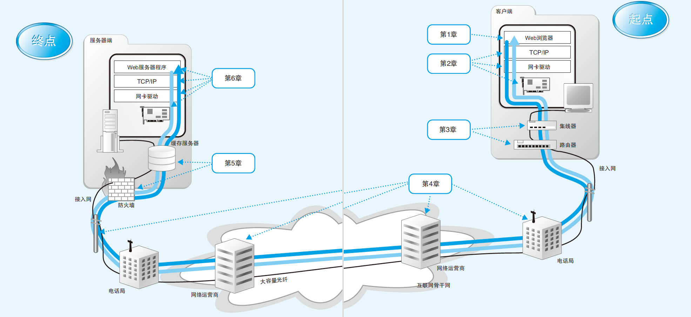
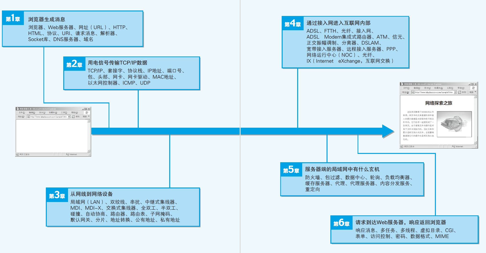

# 结构
  

- 网络是由很多计算机等设备相互连接组成的，因此在通信的过程中需要**确定正确的通信对象**，并将请求和响应发送给它们。
- 请求和响应都是由 0 和 1 组成的数字信息，可以说我们需要的是一种能够将数字信息**搬运**到指定目的地的机制。
- 请求和响应在传递的过程中可能会丢失或损坏，我们需要一种机制，无论遇到任何情况都能够将请求和响应准确无误地发送给对方。
    - 请求和响应的本质都是电信号和光信号，这些信号可能会因受到杂音等的干扰而损坏。
- 这种机制是由操作系统中的网络控制软件，以及交换机、路由器等设备分工合作来实现的。
- 基本思路是将数字信息分割成一个一个的小块，然后装入一些被称为“包”（*Packet*）的**容器**中来运送。
    - 包相当于信件或者**包裹**；交换机和路由器则相当于邮局或快递公司的**分拣处理区**。包的头部存有**目的地等控制信息**，通过许多交换机和路由器的**接力**，就可以**根据控制信息对这些包进行分拣**，然后将它们一步一步地**搬运到目的地**。
- 负责搬运数字信息的机制，再加上浏览器和 Web 服务器这些网络应用程序，这两部分就组成了网络。
## [1. Web 浏览器](01_浏览器.md)
- 浏览器委托操作系统中的网络控制软件将消息发送给服务。
## 2. 协议栈、网卡
- 搬运数据的机制。
- *协议栈*（**网络控制软件**叫作协议栈）
    - 协议栈将从浏览器接收到的消息**打包**，**加上目的地址等控制信息**。
        - 如果拿邮局来比喻，就是把信装进信封，然后在信封上写上收信人的地址。
    - 协议栈还有其他一些功能，例如当发生通信错误时重新发送包，或者调节数据发送的速率等。
    - 接下来协议栈会将包交给网卡。
- *网卡*（**负责以太网或无线网络通信的硬件**）
    - 网卡会**将包转换为电信号**并通过网线发送出去，这样包就进入网络之中了。
## 3. 集线器、交换机、路由器
- 假设客户端计算机连接到家庭或公司的局域网中，再通过 ADSL 和光纤到户（FTTH）等宽带线路接入互联网。
- 在这样的场景中，网卡发送的包会经过交换机等设备，到达用来**接入互联网的路由器**。路由器的后面就是互联网，网络运营商会负责将包送到目的地。
    - 类比：把信件或包裹投到邮筒中之后，邮递员会负责把信送给收件人。
## 4. 接入网、网络运营商
- 互联网的入口线路称为*接入网*。
- 可以用电话线、ISDN、ADSL、有线电视、光线、专线等多种通信线路来接入互联网，这些**通信线路**统称为接入网。
- 接入网连接到签约的网络运营商，并接入被称为*接入点*（Point of Presence, *PoP*）的设备。
    - 接入点的实体是一台**专为运营商设计的路由器**。
        - 可以把它理解为离你家最近的邮局，从你家附近的各个邮筒中收集来的信件会在邮局进行分拣，然后被送往全国甚至全世界。
        - 互联网也是一样，网络包首先通过接入网被发送到接入点，然后再从这里被发送到全国甚至全世界。
- 接入点的后面就是互联网的骨干部分。
- 骨干网中存在很多运营商和大量的路由器，这些路由器相互连接，组成一张巨大的网，而我们的网络包就在其中经过若干路由器的接力，最终被发送到目标 Web 服务器上。
    - 其中的基本原理和家庭、公司中的路由器是相同的，无论是在互联网中，还是在家庭、公司的局域网中，**包都是以相同的方式传输**，这也是互联网的一大特征。
    - 运营商使用的路由器跟家用的小型路由器不一样，它是一种可以连接几十根网线的高速大型路由器。在互联网的骨干部分，存在着大量的这种路由器，它们之间以复杂的形式连接起来，而网络包就在这些路由器之间穿行。
    - 家庭和公司局域网中一般采用以太网线进行连接，互联网中除了以太网线连接之外，还会使用比较古老的电话技术和最新的光通信技术来传送网络包。
## 5. 防火墙、缓存服务器
- 通过骨干网之后，网络包最终到达了 **Web 服务器所在的局域网**中。
- 接着，它会遇到*防火墙*，防火墙会对进入的包进行检查。
    - 可以把防火墙想象成门口的保安，他会检查所有进入的包，看有没有危险的包混在里面。
- 防火墙检查完之后，网络包接下来可能还会遇到*缓存服务器*。
    - 网页数据中有一部分可以重复利用，这些可以重复利用的数据就被保存在缓存服务器中。如果要访问的网页数据正好在缓存服务器中能够找到，就可以不用劳烦 Web 服务器，直接从缓存服务器读出数据。
    - 在大型网站中，可能还会配备将消息分布到多台 Web 服务器上的负载均衡器，还有可能会使用通过分布在整个互联网中的缓存服务器来分发内容的服务。
- 经过这些机制之后，网络包才会到达 Web 服务器。
## 6. Web 服务器
- 当网络包到达 Web 服务器后，数据会被**解包并还原为原始的请求消息**，然后交给 Web 服务器程序。
    - （和客户端一样）这个操作也由操作系统中的协议栈来完成。
- Web 服务器程序分析请求消息的含义，并按照其中的指示将数据装入响应消息中，然后发回给客户端。
- 当响应到达客户端之后，浏览器会从中读取出网页的数据并在屏幕上显示出来。